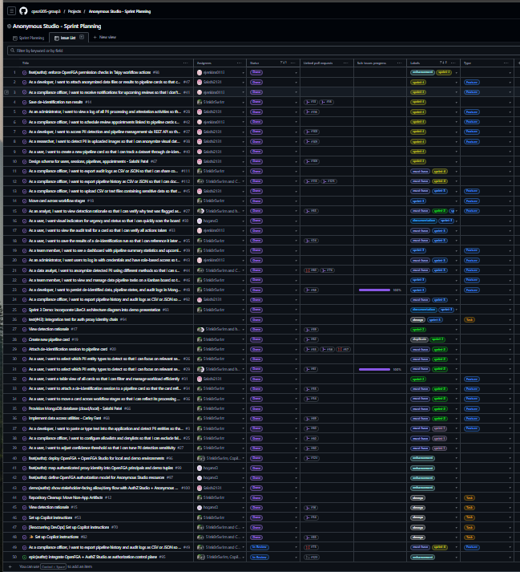
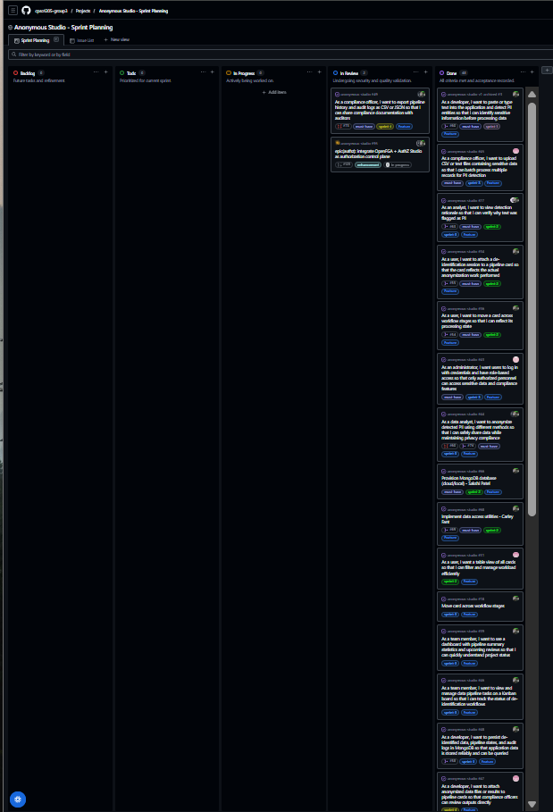

## Sprint 5 Retrospective

**Team Name:** Group 3 - Anonymous Studio

**Sprint Number:** 5

**Date Range:** 04/06/26 - 04/19/26

**Team Members:** Carley Fant, Diamond Hogans, Sakshi Patel, Elijah Jenkins

---

## Sprint Summary

This sprint focused on security hardening, production readiness, and closing critical authorization gaps in the OpenFGA implementation. Key work included fixing authorization bypass vulnerabilities, aligning the OpenFGA model with runtime enforcement, integrating notification system improvements, and preparing comprehensive demo materials.

**Carley Fant:** This sprint focused on security hardening and production readiness — reviewing and merging PR #123 which closed critical OpenFGA authorization bypass vulnerabilities in audit export handlers, aligned the seeded authorization model with runtime enforcement, and added comprehensive regression tests. Additional work included integrating notification system improvements from PR #120, creating demo materials (launch script with interactive backend selection and comprehensive presentation guide), and managing Git workflow for the new `feat-sprint-5` branch. The emphasis was on ensuring the system is secure and deployment-ready rather than adding new features.

**Diamond Hogans:** [Summary]

**Sakshi Patel:** [Summary]

**Elijah Jenkins:** [Summary]

---

## GitHub Project Board Review

### Board View

### Table View

| Metric | Count |
|--------|-------|
| Tasks Planned at Sprint Start | |
| Tasks Completed | |
| Tasks Not Completed | |

### Completed Tasks

**Carley Fant:**
- **PR #123 Review & Integration** — Reviewed and merged OpenFGA enforcement gap fixes: closed authorization bypass in audit export handlers, aligned OpenFGA seed model with runtime job permissions (`can_submit`, `can_cancel`), extended `tests/test_authz.py` with deny/unauthenticated tests, updated `tests/test_openfga_seed.py` for model validation; merged to `main` 2026-04-19
- **PR #120 Integration** — Merged notification system improvements and settings UI into `feat-sprint-5` branch: refactored notifications service, added user preference toggles, enhanced scheduler logging
- **Demo Materials** — Created `SPRINT5_DEMO_SCRIPT.md` with comprehensive 15-20 minute demo flow, technical talking points, Sprint 5 security narrative, and backup Q&A responses
- **Launch Script** — Created `RUN_SPRINT5_DEMO.sh` with interactive backend selection (Memory/DuckDB/MongoDB), automatic MongoDB startup via Docker, and clean ASCII output for professional screen recording
- **Branch Management** — Created and managed `feat-sprint-5` branch from latest `main`, resolved merge conflicts, ensured clean integration of security fixes
- **Dependency Updates** — Integrated Dependabot security updates (PR #119: actions/github-script v8→v9)

**Diamond Hogans:** [Completed tasks]

**Sakshi Patel:** [Completed tasks]

**Elijah Jenkins:** [Completed tasks]

### Not Completed

[Issues carried forward to next sprint]

### Scope Changes

Sprint 5 shifted from feature development to security hardening and production readiness. The focus on closing OpenFGA authorization gaps and ensuring deployment-ready code took priority over new feature work, which aligns with capstone project completion timeline.

---

## Sprint Planning vs. Reality

### Planned vs. Completed Work

**Carley Fant:** Sprint 5 was intentionally scoped as a security and polish sprint rather than feature development. All planned work was completed: PR #123 security fixes were reviewed and merged, notification system improvements were integrated, and comprehensive demo materials were created to showcase the semester's work. The Git workflow required more attention than anticipated due to managing multiple concurrent PRs and ensuring clean merges into the new sprint branch.

**Sakshi Patel:** [Planning vs. reality]

**Diamond Hogans:** [Planning vs. reality]

**Elijah Jenkins:** [Planning vs. reality]

### Contribution Distribution

Based on GitHub contributor data for this sprint:

- **Carley Fant:** PR #123 review and merge (security fixes), PR #120 integration (notifications), PR #119 integration (dependency updates), 2 new documentation files (demo script + launch script), branch management for `feat-sprint-5`, retrospective documentation
- **Diamond Hogans:** [Contribution summary]
- **Sakshi Patel:** [Contribution summary]
- **Elijah Jenkins:** [Contribution summary]

---

## What Went Well

- Critical security vulnerabilities in OpenFGA authorization were identified and fixed before deployment
- PR #123 included comprehensive regression tests to prevent future authorization bypasses
- OpenFGA seed model now accurately reflects runtime enforcement semantics
- Demo materials provide clear narrative for showcasing semester's work
- Launch script automates MongoDB setup and provides clean, professional output
- All merges to `feat-sprint-5` completed without conflicts
- Notification system integration from PR #120 added polish to user experience

[Additional team items]

---

## What Didn't Go Well

- Sprint 5 had minimal new feature development due to focus on security hardening
- Limited team coordination on final sprint scope and priorities
- Demo preparation materials created late in sprint timeline

[Additional items]

---

## Action Items for Next Sprint

**Note:** Sprint 5 is the final sprint for this capstone project. The following items would apply to future maintenance or deployment:

- **Deploy to production environment** — Assigned to: TBD
- **Set up monitoring and alerting** — Assigned to: TBD
- **Document deployment runbook** — Assigned to: TBD
- **Conduct security audit** — Assigned to: TBD

[Additional items]

---

## Individual Reflections

**Carley Fant:**
Sprint 5 was about ensuring the system is actually production-ready, not just feature-complete. Reviewing PR #123 revealed critical authorization bypass vulnerabilities in audit export handlers — the kind of security gap that would be unacceptable in a real healthcare or legal deployment. Fixing these issues, aligning the OpenFGA model with runtime enforcement, and adding regression tests was the right priority for a final sprint. The demo materials (launch script + presentation guide) provide a clear narrative for showcasing the complete system built this semester: enterprise-grade PII detection, fine-grained authorization, batch processing, audit logging, and multi-backend storage. Compared to earlier sprints where I was building features and fixing teammate bugs, this sprint felt like stepping back to ensure everything is secure, documented, and ready to present. The system went from concept to deployment-ready in one semester, which is significant for a solo-heavy capstone project.

**Diamond Hogans:** [2-4 sentences]

**Sakshi Patel:** [2-4 sentences]

**Elijah Jenkins:** [2-4 sentences]

---

## Team Notes

**Diamond Hogans** notified the team of her withdrawal from the course during Sprint 5. Her sections in this retrospective remain incomplete as she was not actively participating in sprint activities.
